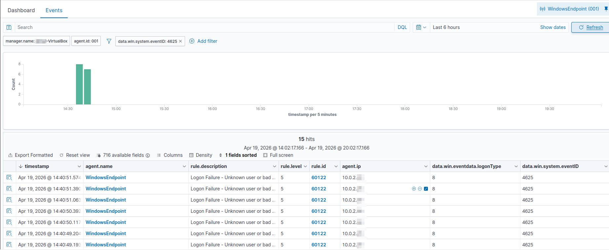
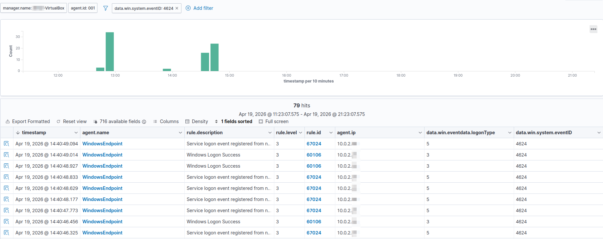
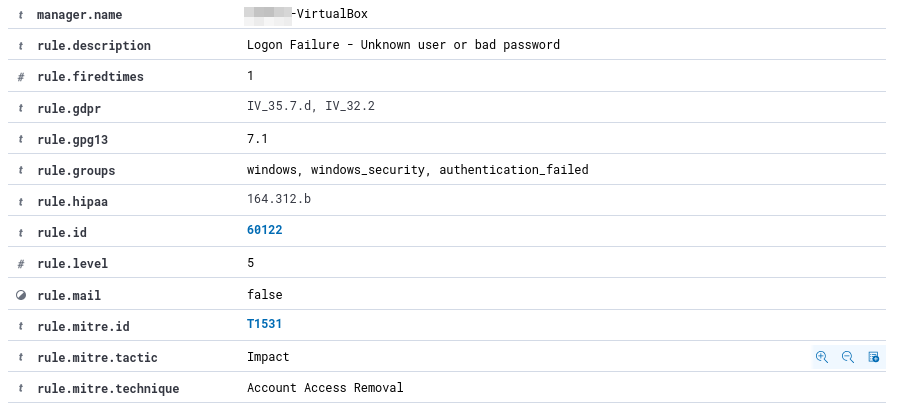
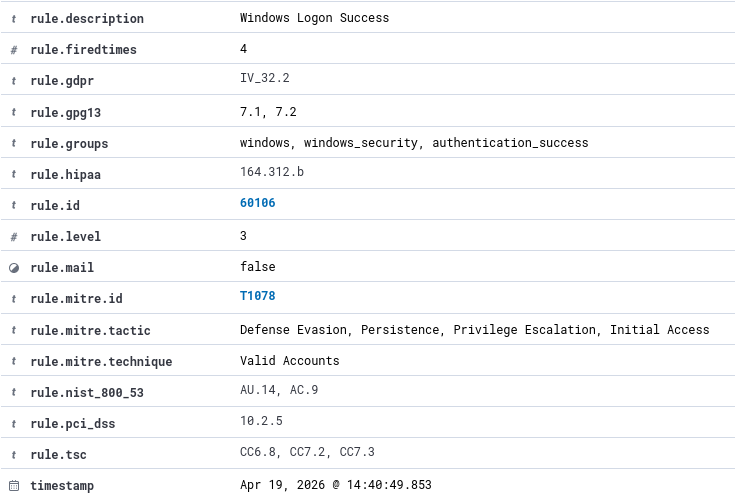
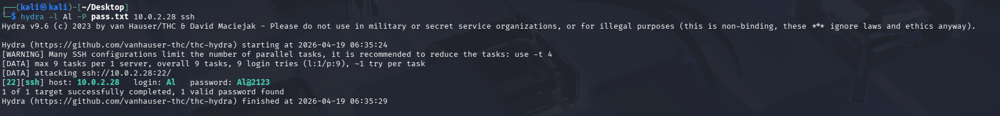

# 🔐 Windows SSH Brute Force Attack Detection & Analysis using Wazuh

## Overview 
This project simulates a real-world brute-force attack and demonstrates how security monitoring tools can detect, analyze, and respond to unauthorized access attempts.

## Objectives
* Detect brute-force login attempts
* Analyze Windows event logs
* Identify Indicators of Compromise (IOCs)
* Perform root cause analysis
* Map attack techniques to MITRE ATT&CK framework

## Lab Setup
* Wazuh Server: Ubuntu VM
* Victim Machine: Windows VM (OpenSSH Enabled)
* Attacker Machine: Kali Linux

## Attack Scenario
1. Reconnaissance using Nmap
2. Brute Force Attack using Hydra
3. Credential Compromise & SSH Access

## Key Findings
* Multiple failed login attempts (Event ID 4625)
* Successful login after brute-force attempts
* No account lockout policies
* Password-based authentication enabled

## Indicators of Compromise (IOCs)
* Attacker IP: 10.0.2.X (Kali Linux - Internal Lab Network)
* Suspicious Username: NOUSER
* Multiple failed login attempts
* SSH process activity (sshd.exe)

## Mitigation Strategies
* Disable Password Authentication
* Enable SSH key-based authentication
* Implement account lockout policies
* Use tools like Fail2Ban
* Enforce strong password policies

## Project Files 

## 📸Attack Evidence & Log Analysis 
### 🔍Brute Force Detection (Failed Logins)
The following logs show multiple failed login attempts (Event ID 4625), indicating a brute-force attack in progress:

---

### ✅Successful Compromise
After repeated attempts, successful login attempts were observed, confirming credential compromise:

---

### 📊Wazuh Alert Correlation
Wazuh SIEM correlates these events and flags suspicious authentication behavior:

---

### ⚔️Attack Simulation (Hydra Output)
The brute-force attack executed using Hydra generated several rapid authentication attempts:

---

## 🛠️ Tools used
* Wazuh (SIEM)
* Nmap (Reconnaissance)
* Hydra (Brute Force Simulation)
* Windows Event Logs

## Skills Demonstrated 
* Security Monitoring & SIEM (Wazuh)
* Log Analysis & Event Correlation
* Threat Detection & Investigation
* Incident Response Fundamentals
* MITRE ATT&CK Mapping

---
👩‍💻Created by Aaliya Khalil
📌Aspiring SOC Analyst | Cybersecurity Enthusiast

